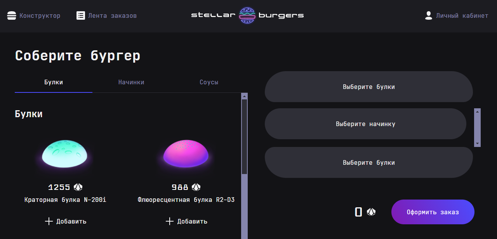
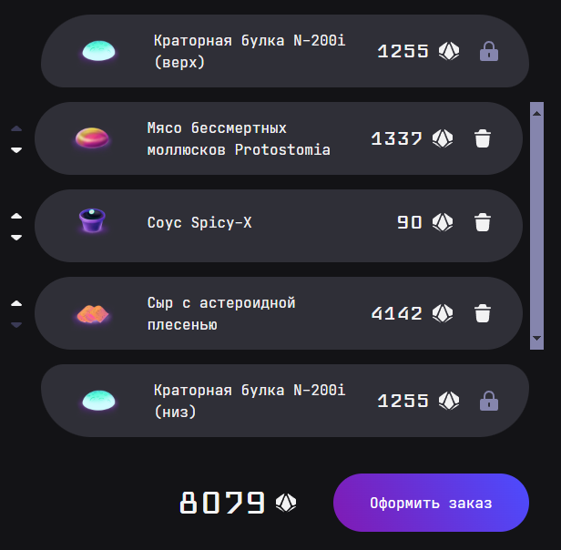
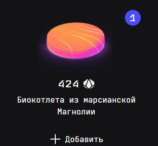
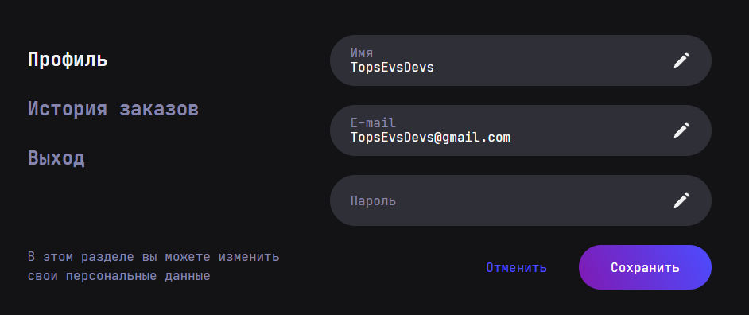
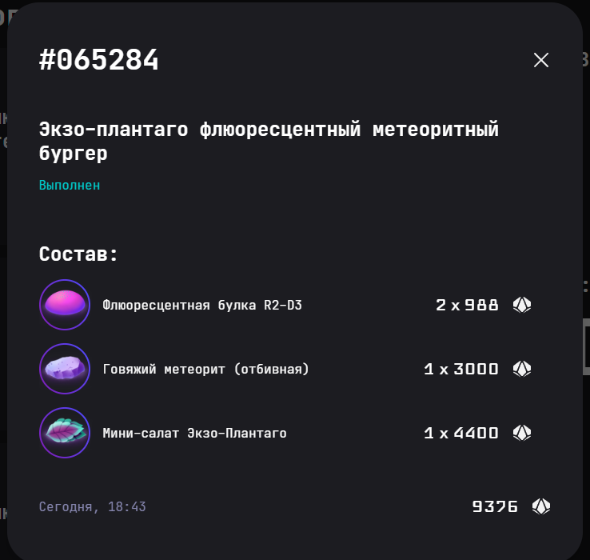
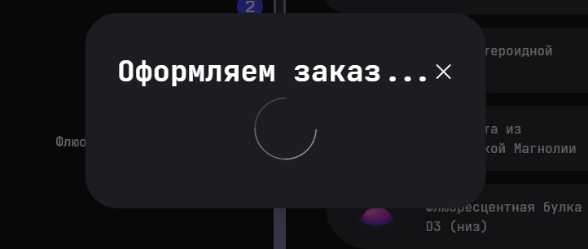
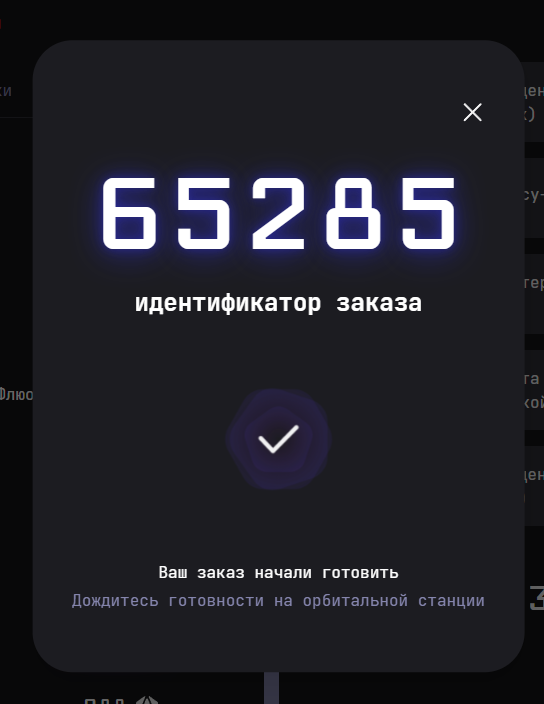
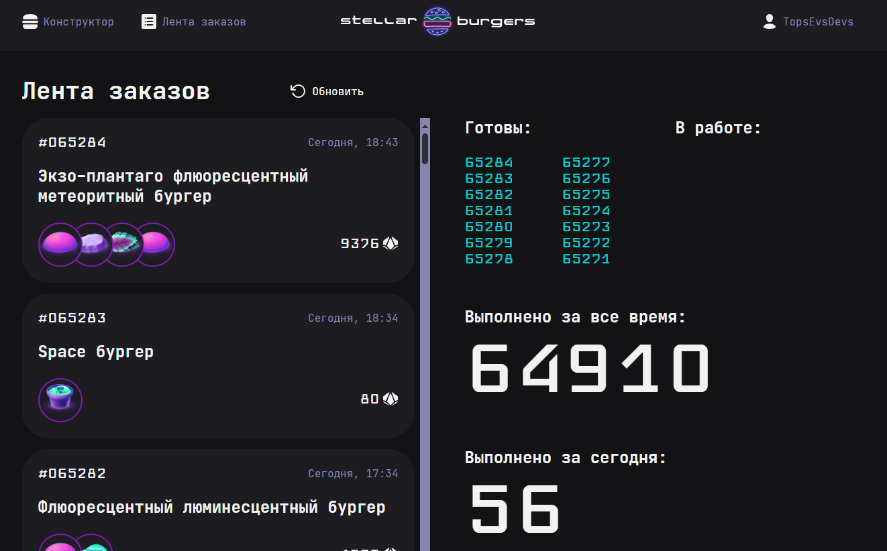
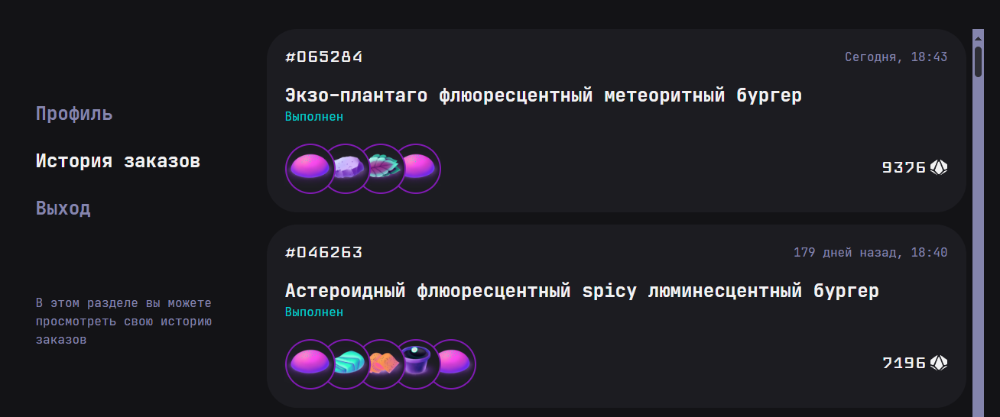
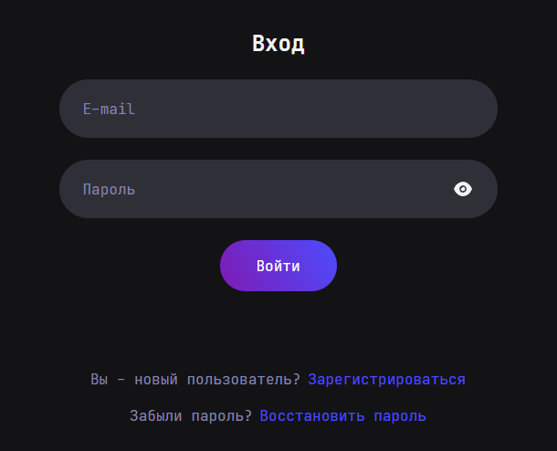

# Проектная работа "Stellar Burger"

## Описание

Это проект представляет собой веб-приложение для конструктора бургеров и системы управления заказами. Позволяет пользователям собирать бургеры из доступных ингредиентов, оформлять заказы и отслеживать их статус. Приложение включает в себя общедоступные функции и защищенные страницы для авторизованных пользователей, такие как личный кабинет с историей заказов. Для работы с тестами в проект были установлены Cypress и Jest. Настроены скрипты для запуска тестов, созданы структуры файлов для удобства их хранения и поддержки.



## Стек

- Frontend: **React, JavaScript, TypeScript, Redux Toolkit**
- Роутинг: **React Router**
- Стили: **CSS-модули**
- Разметка: **HTML5**
- Тестирование: **Jest, Cypress**
- Сборка: **Webpack**

## Структура проекта

- `src/ `— исходные файлы проекта.
- `src/index.tsx` — основной файл, где приложение подключается к DOM через ReactDOM.
- `public/index.html` — HTML-файл главной страницы.
- `src/components/` — папка с JS компонентами.
- `src/components/ui/` — папка с UI-kit компонентами.
-
- `src/pages/` — папка с компонентами работы страниц роутинга.
- `services/slices/` — Redux Toolkit слайсы, которые управляют состоянием приложения.
- `services/slices/__tests__/` — тут проверяется корректность работы редьюсеров, экшенов и thunk-функций.
-
- `cypress/` - папка с интеграционными тестами, написанными на Cypress. Тестирует работу приложения в браузере: переходы, отображение данных, взаимодействие с формами.
- `coverage/` - отчёты о покрытии кода тестами. Используется для оценки качества тестирования и выявления необхваченных участков кода.

## Инструкция по запуску

1. Скачайте или клонируйте репозиторий.
2. Выполните команды в терминале

```
npm install
npm run start
```

В проекте имеется сборка Webpack в нескольких вариантах:

- `start` - для локальной разработки и просмотра
- `lint` - проверка и исправление кода _(для проверки JavaScript, TypeScript, JSON и JSX файлов)_
- `format` - форматирование кода _(использует Prettier для форматирования, включая JavaScript, TypeScript, CSS и Markdown)_
- `test` - скрипт запускает тесты с помощью фреймворка Jest
- `cypress:open` - запускает Cypress с графическим интерфейсом для написания и отладки сквозных тестов

### Ссылка на репозиторий:

`https://github.com/PolliSun/stellar-burger.git`

*для корректной работы запросов к серверу необходимо добавить переменную BURGER_API_URL в окружение. Сама ссылка находится в файле `.env.example`*

## Реализованный функционал

- Пользователь может добавлять ингредиенты в конструктор. Включает подсчёт стоимости заказа. Показывает структуру бургера (верхняя булка, начинки, нижняя булка). Возможность перемещать составляющие заказа в конструкторе бургера и удалять их.
- Создано взаимодействие с сервером через асинхронные запросы, используя Redux для хранения и управления данными. Пользовательские данные, ингредиенты и заказы загружаются с сервера при переходах между страницами.
- Реализованы формы для регистрации, авторизации и восстановления пароля. Пользователи могут создавать учетные записи, авторизовываться и изменять свои данные на странице профиля. Без авторизации некоторые страницы и действия (например, создание заказа) недоступны.
- Реализована работа модальных окон для отображения подробной информации о заказах и ингредиентах. Модальные окна открываются по клику на элементы в лентах заказов или ингредиентов и закрываются при нажатии на крестик или оверлей.
- Леализована форма с возможностью редактирования данных профиля пользователя. При изменении данных появляются кнопки "Отмена" и "Сохранить". При нажатии на "Сохранить" отправляется запрос на сервер с новыми данными, а при нажатии "Отмена" форма возвращает первоначальные значения.
- Страница истории заказов доступна только для авторизованных пользователей и отображает их заказы с их статусами. При клике на заказ отображается его в модальном окне.

## Что сделано

- Установлен и настроен react-router-dom для управления маршрутами.Реализованы защищенные маршруты для авторизованных пользователей:

```
<ProtectedRoute onlyUnAuth>
    <Login />
</ProtectedRoute>
```

Настроены компоненты для каждой страницы: конструктора, ленты заказов, профиля и истории заказов. Для страниц с динамическим контентом созданы модальные окна для отображения подробностей заказов и ингредиентов.

```
<Modal title='Детали ингредиента' onClose={closeModalIngredient}>
    <IngredientDetails />
</Modal>
```

Обработан маршрут для ошибки 404.

```
<Route path='*' element={<NotFound404 />} />
```
- 

- Настроены асинхронные запросы с использованием Redux для получения данных с сервера.

```
export const getIngredients = createAsyncThunk(
  'ingredients/getIngredients',
  getIngredientsApi
);
```

Созданы редюсеры для управления состоянием данных. Реализована логика загрузки данных с сервером, с отображением лоадеров во время запросов. Добавлена логика для обработки ошибок API-запросов. Реализованы селекторы для получения данных из `Redux Store` и их отображения на страницах.

```
const ingredients = useSelector(getIngredientsState);
```
- 

- Создана форма редактирования профиля пользователя, где подставляются текущие данные. Обработана синхронизация данных в `Store` с сервером.

```
const [formValue, setFormValue] = useState({
    name: user.name,
    email: user.email,
    password: ''
});
```

Реализовано изменение данных с кнопками "Сохранить" и "Отмена". При нажатии на "Сохранить" отправляется запрос на сервер с измененными данными. При нажатии "Отмена" форма возвращает старые значения, а кнопки скрываются.


- Созданы модальные окна для отображения деталей ингредиентов и заказов, с использованием `createPortal`. Модальные окна открываются при клике на соответствующие элементы, а закрываются по клику на крестик, оверлей или клавишу ESC.

```
return ReactDOM.createPortal(
    <ModalUI title={title} onClose={onClose}>
      {children}
    </ModalUI>,
    modalRoot as HTMLDivElement
);
```

Для каждого маршрута с деталями заказов или ингредиентов настроены динамические маршруты. Добавлена логика для закрытия модальных окон и возвращения пользователя на предыдущую страницу.




- Лента заказов обновляется в реальном времени с добавлением нового заказа. Обновлять можно с помощью кнопки "Обновить" Каждый заказ отображается с подсчетом стоимости всех ингредиентов. Реализовано отображение количества всех заказов и подсчета заказов за день.

```
const { number } = useParams<{ number: string }>();

  useEffect(() => {
    if (number) {
      dispatch(getOrderByNumber(parseInt(number)));
    }
}, [dispatch, number]);
```

Страница доступна для всех пользователей, как авторизованных, так и неавторизованных.


- Страница истории заказов доступна только для авторизованных пользователей. Реализована загрузка данных о заказах с сервера, с подсчетом стоимости всех ингредиентов, отображение статусов ("Отменён", "Готовится", "Выполнен").

```
export const getOrder = createAsyncThunk('order/getOrders', async () =>
  getOrdersApi()
);
```

При клике на заказ открывается модальное окно с полными данными о заказе.


- Реализованы страницы для регистрации, авторизации и восстановления пароля. Добавлены формы для ввода данных и логики проверки введенных данных.

```
dispatch(loginUser({ email: email, password: password }));
```

Реализована защита страниц с важной информацией, доступной только авторизованным пользователям. Добавлена логика редиректа на страницу входа, если пользователь не авторизован.

```
if (!user) {
    navigate('/login');
    return;
}
```

Реализован функционал для восстановления пароля и отправки запросов на изменение данных.
- 

- Интеграционные тесты на `Cypress` были реализованы для проверки ключевых пользовательских сценариев. Разработаны моковые данные для ингредиентов и сохранены в папке `cypress/fixtures/`. Эти данные используются для симуляции ответа сервера и тестирования функционала. Настроен перехват запросов с подменой реального ответа на моковые данные.

```
cy.intercept('GET', 'api/ingredients', {
    fixture: 'ingredients.json'
}).as('getIngredients');
```

Проверена возможность добавления ингредиентов из списка в конструктор. Тесты охватывают добавление одной булки и нескольких начинок, а также корректность отображения итоговой стоимости бургера.

```
it('Тест добавление булки, начинки и соусов', () => {
    cy.get(ingredientBun + ' button').click();
    cy.get('[data-cy="ingredient-643d69a5c3f7b9001cfa0941"] button').click();
    cy.get('[data-cy="ingredient-643d69a5c3f7b9001cfa0942"] button').click();
});
```

Тесты проверяют открытие модального окна при клике на ингредиент, его закрытие через крестик или оверлей, а также корректное поведение интерфейса после закрытия. Разработаны моковые данные для авторизации и ответа сервера при создании заказа.

```
cy.intercept('GET', 'api/auth/user', {
    fixture: 'user.json'
});
```

Тесты проверяют процесс сборки бургера, отправку заказа, отображение номера заказа в модальном окне и очистку конструктора после успешного создания заказа.

- Юнит-тесты на `Jest` были разработаны для проверки корректной работы всех редьюсеров приложения. В каждой папке слайса созданы отдельные файлы для написания соответствующих тестов.
  1.  Тестирование редьюсера конструктора `constructorSlice` Проверена обработка экшена добавления ингредиента:
      - новый ингредиент корректно добавляется в список ингредиентов конструктора.
      - написан тест, проверяющий корректное удаление ингредиента из списка.
      - написаны тесты, подтверждающие правильность изменения порядка начинок внутри конструктора.
      - ```
        test('Тест обработка начального состояния конструктора', () => {
            expect(reducer(undefined, { type: 'unknown' })).toEqual(initialState);
        });
        ```

Проверка для обработки состояний приложения при различных экшенах, проверка редьюсеров слайса `ingredientsSlice`. Тестируется корректное обновление данных при успешной загрузке ингредиентов, обработка ошибок и начальное состояние.

- Настроена возможность просмотра покрытия тестами отдельных файлов или проекта в целом.

## Благодарность

Выражаю благодарность **Яндекс Практикуму** за предоставление дизайна и теории.
